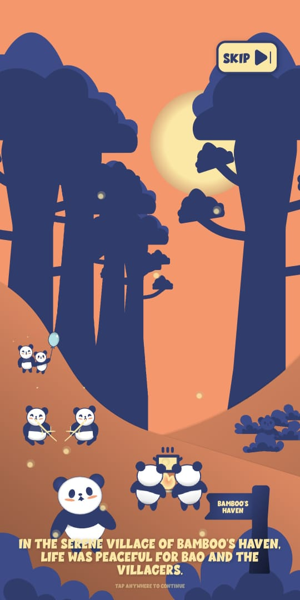
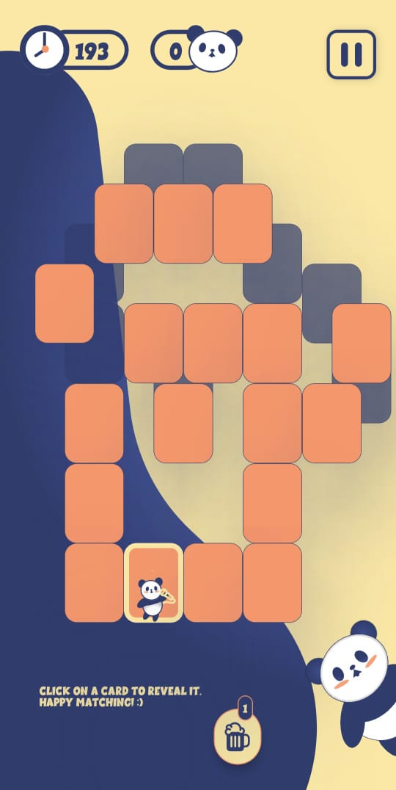

# Panda Tales

Panda Tales is a captivating matching game where players embark on an adventure to unlock parts of the story every few levels. Depending on their performance, players can experience a good ending or a bad ending, making every choice crucial.

## Table of Contents

- [Overview](#overview)
- [Features](#features)
- [Tech Stack](#tech-stack)
- [Screenshots](#screenshots)
- [Download the Game](#download-the-game)
- [Installation](#installation)
- [License](#license)

## Overview

Panda Tales follows the story of **Bao**, a young panda from the village of Bamboo's Haven. Players match cards to progress through levels, unlocking more parts of the tale with each successful chapter. The game offers both good and bad endings based on player choices and performance.

## Features

- **Matching Game:** Classic card-matching gameplay.
- **Story Unlocks:** Unlock parts of the story every 5 levels.
- **Multiple Endings:** Experience a good or bad ending depending on your performance.
- **Power-Ups:** Use unique power-ups to gain an advantage.
- **Beautiful Animations:** Enjoy fluid animations, including spiraling warp effects and parallax background scenes.

## Download The Game
[](https://expo.dev/artifacts/eas/3uVg36K9C83HuoZ9mm5xBL.apk)


## Tech Stack

- **Frontend**: React.js, TypeScript, CSS (with Expo for the mobile version)
- **State Management**: Jotai
- **Animations**: React Native Animations, Expo
- **Bundling**: Webpack, Metro Bundler (for React Native)

## Screenshots

| Description                  | Screenshot  |
|-------------------------------|-------------|
| Story Cutscene       |  |
| Matching Cards Gameplay  |  |

## Installation

### Prerequisites

- **Node.js** (version 14+)
- **npm** or **yarn**

### Clone the repository:

```bash
git clone https://github.com/your-repo/panda-tales.git
```

## License

This project and its source code are proprietary and are not to be copied, distributed, modified, or used without explicit permission from the author. 

### Restrictions

- No one is allowed to reproduce or distribute any part of this project in any form.
- Modification, creation of derivative works, or distribution of this code is strictly prohibited without written consent from the author.

All rights reserved © 2024 Jessica
